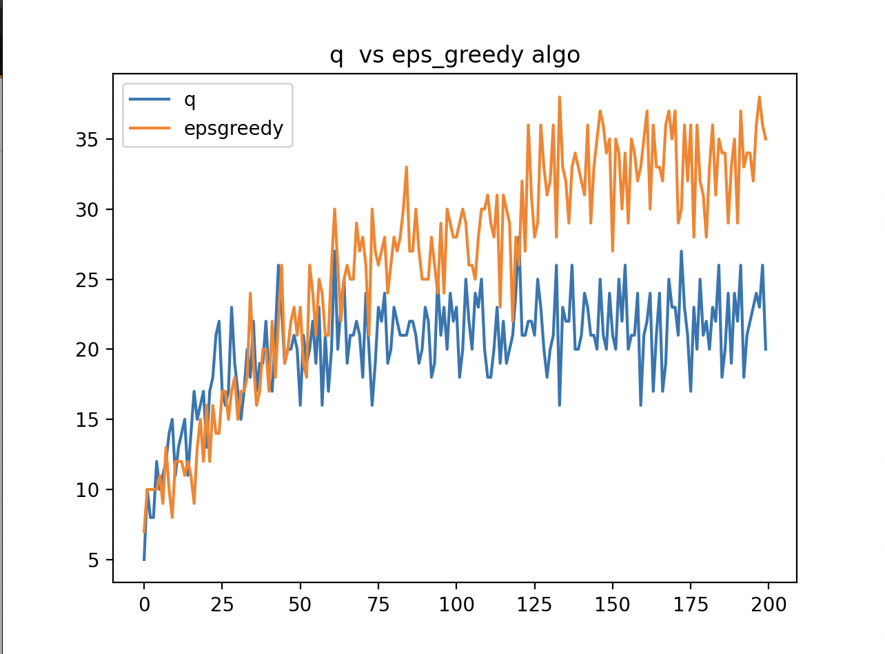
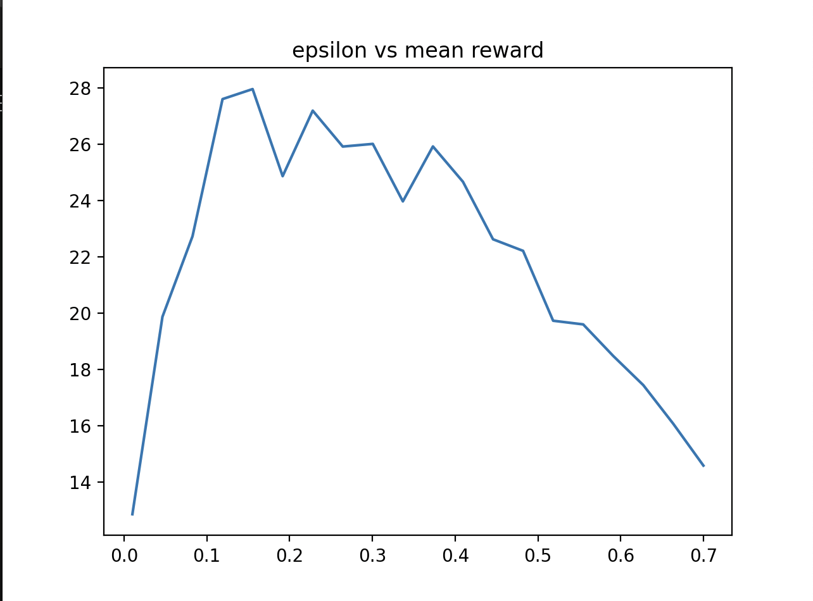
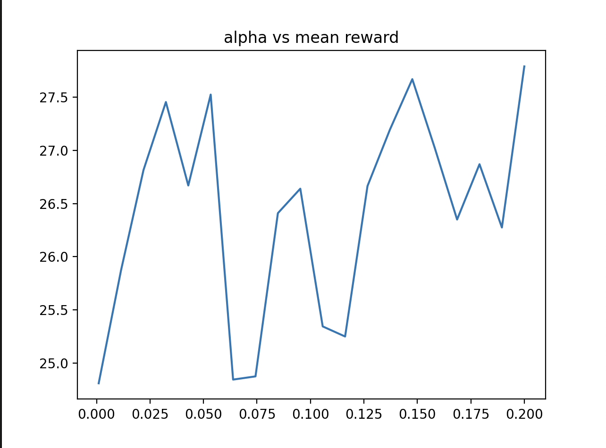

# Song Recommendation Model Using Reinforcement Learning

## Project Description
Ever try to use the random functionality on your phone when you're playing songs only to skip the songs you didn't like anyways because you don't know what you like but you do know what you don't like for sure? This model is for that
This project implements a model that recommends songs using reinforcement learning. The model aims to enhance the user's listening experience by minimizing the number of skipped songs. 

### States
The states in this model represent the currently playing song.

### Actions
The actions correspond to the songs that have not yet been played.

### Reward
The reward mechanism is simple: if the song is not skipped,1  is given; otherwise, 0 is assigned.

## Training Process
The training process involves modeling the list of songs using $\( t_{i,j} \)$ such that $\( t_{i,j} \)_j$ are the songs that will not be skipped after $t_i$. This setup simulates a real-world environment, making the problem non-stationary. Consequently, a constant learning rate is used.

### Comparison of Algorithms
During the training, we compare the performance of two algorithms:
1. Q-Learning
2. Average State Values Algorithm

#### Performance Comparison Plot


## Script Usage
The script offers three modes of operation:

1. **Training Mode**:
   - This mode is used to train the model and visualize the comparison between Q-Learning and Average State Values.
   - Usage: `enter mode : -tr`
   - Output: Generates `q_algo.png` showing the performance comparison.

2. **Fine-Tuning Mode**:
   - This mode is used for fine-tuning the model.
   - Usage: `enter mode : -f`


   - Output: Generates `epsilon.png if mode "e"` and `learning_rate.png if mode "a"` to visualize the effect of different epsilon values and learning rates.

   #### Epsilon Values Plot
   

   #### Learning Rate Plot
   

3. **Testing Mode**:
   - This mode is used to test the trained model in a real-world scenario.
   - Usage: `enter mode : test`
   - This mode allows you to experience the model's performance live.
  
### Possible Implementation
1. **Discord Bot**
   can build a discord bot using python and detect the spotify activity of a user and then use the spotify api to skip
2. **Android App**
   build an android app using kivy or tkinter and detect when the song is playing on phone and skip when needed

### Example Commands
```sh
# Train the model and compare algorithms
enter mode : -tr

# Fine-tune the model
enter mode: -f

# Test the model in real-world scenarios
enter mode: -test
```

By following the steps outlined above, you can train, fine-tune, and test the song recommendation model to achieve the best performance in minimizing skipped songs and enhancing the user's listening experience.
